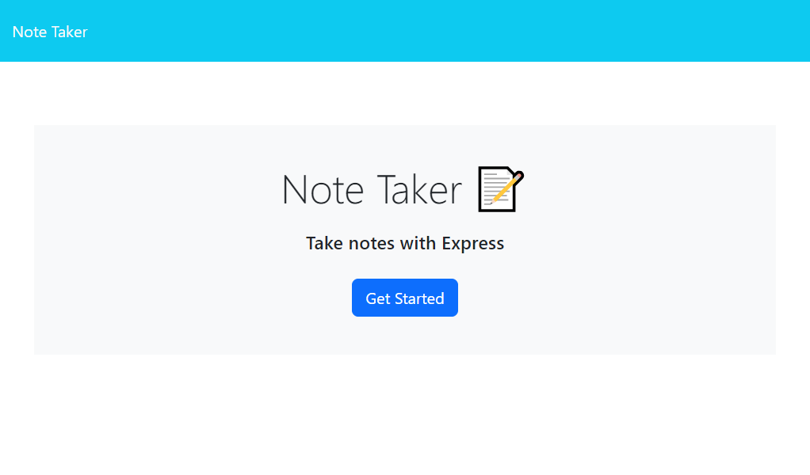
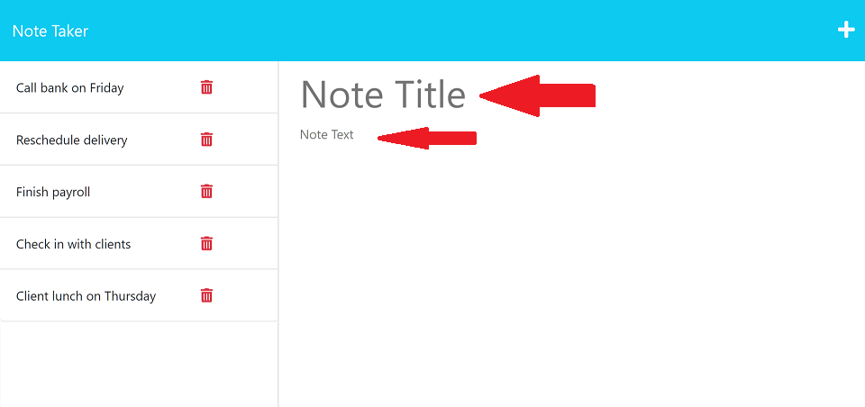
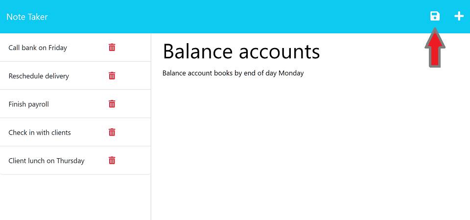
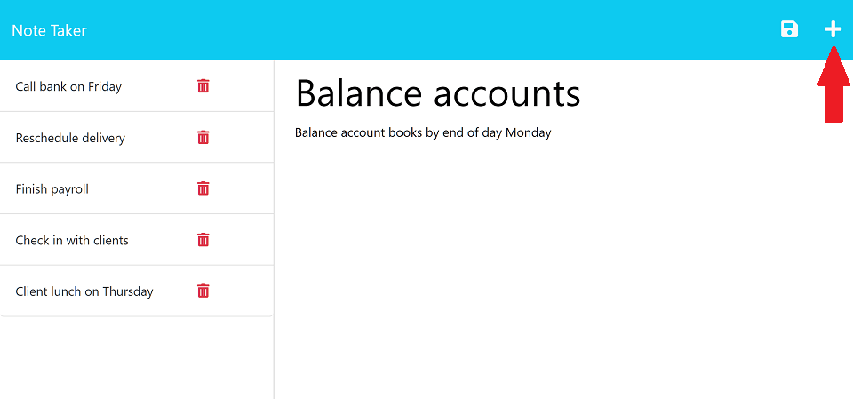
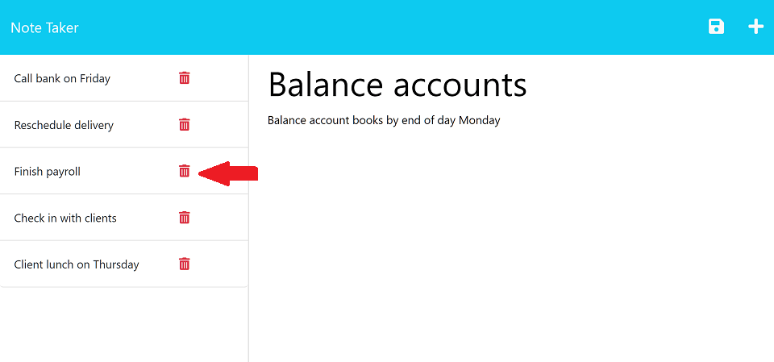

# My Easy Notes  

  
  https://myeasynotes-f5c4a6c5cb17.herokuapp.com/notes

## DESCRIPTION
This is an app that writes and saves notes to make it easier to handle your everyday tasks. Organize your thoughts, keep track of your goals and become as productive as you're meant to be. Feel the magic!

## TABLE OF CONTENTS
* [Usage](#instructions)
* [Contributing](#contribution)
* [License](#license)
* [Contact](#contact)

## USAGE
1 - On the main page, click on the Get Started button. You will be redirected to the Note Taker app.  
  
2 - On the right side of the page, you will find the Note Title and the Note Text areas. Click on them to add the title and the text of your note.  

   
    
3 - When you finish typing your note, you will notice a save button on the upper left corner of your screen. Click on it to save your note.  
  
    

4 - Notice that your note is now displaying on the right side of the page. That's your notes list.  

5 - If you click on any of the notes, it will be displayed larger for you in the right side of the page.  

6 - Clicking on the plus sign on the top left corner of the screen will clear the field allowing you to write a new note.  

7 - Click on the delete button when you don't need that note anymore. It will be gone foreveeeeer!  

  
It's easy as that. 

## CONTRIBUTING
You are welcome to help if you have any ideas to improve our project! If you want to do so, just follow these steps:

1 - Fork the repository.  
2 - Create a new branch for you new feature or bug fix.  
3 - Make the changes you have in mind.  
4 - Commit your changes and push them to your fork.  
5 - Open a pull request detailing the changes you've made.

## LICENSE
MIT license

# CONTACT
* Github: [LeopoldoGurgel](https://github.com/LeopoldoGurgel)
* E-mail: leopoldogbp@gmail.com

This file was generated by Easy Readme Generator